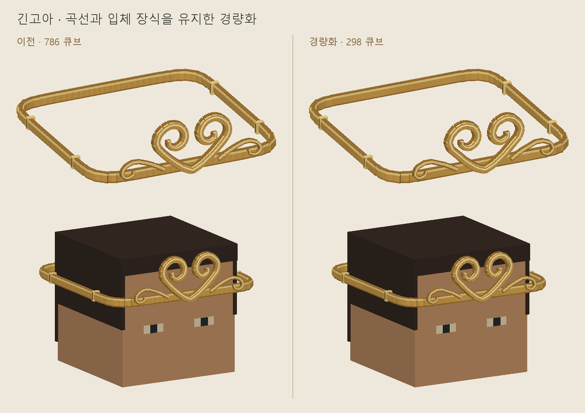

# Wukong

제천대성의 여의봉·긴고아·근두운. Minecraft Java 1.21.8용 장비 모델과 편집 가능한 Blockbench 원본입니다.

| 장비 | 큐브 수 | Blockbench 원본 |
| --- | ---: | --- |
| 여의봉 | 256 | [jingubang_v2_optimized.bbmodel](blockbench/jingubang_v2_optimized.bbmodel) |
| 긴고아 | 298 | [jingeuna_optimized.bbmodel](blockbench/jingeuna_optimized.bbmodel) |
| 근두운 | 292 | [jindouyun.bbmodel](blockbench/jindouyun.bbmodel) |

여의봉은 붉은 봉과 금색 끝장식을 유지한 v2 최적화본입니다. 선택한 원본의 손 위치 설정까지 반영했습니다. 긴고아는 금색 입체 장식과 착용 크기를 유지하며 **786 → 298큐브(62.09% 감소)**로 줄였습니다. 근두운은 단순화한 292큐브 외형입니다.

## 다운로드

[Wukong 릴리스](https://github.com/sohxx7/newhwalcass-resourcepack/releases/tag/v2026.09.08-wukong)에서 내려받습니다.

- **Newhwalcass.zip**: 기존 신규·업데이트 리소스팩에 장비 3종을 합친 전체 팩입니다. 기존 Newhwalcass를 교체하고 본체 팩 `lHwalcass.zip`보다 위에 활성화합니다.
- **Wukong.zip**: 장비 3종만 포함한 팩입니다. 별도로 확인할 때 기존 팩보다 위에 활성화합니다.
- **Wukong_sources.zip**: Blockbench 원본, 미리보기, 검수 기록과 장비 팩입니다.

[지급 명령과 사용 안내](../docs/wukong.md)를 참고하세요. 긴고아는 머리 슬롯에 착용합니다. 근두운의 탑승·비행 및 무기 스킬은 별도 서버 구현이 필요합니다.

## 검수

기존 배포 팩의 1,159개 파일을 바이트 단위로 보존하고 모델·아이템 등록·텍스처 9개 파일을 추가했습니다. 모델 좌표·회전·UV·텍스처 연결, Blockbench 원본과의 일치, ZIP 무결성 검사를 통과했습니다. 세부 결과는 [validation.json](validation.json)에 있습니다.

이미지는 모델 데이터로 만든 미리보기입니다. 실제 Minecraft 클라이언트 장착 화면과 FPS는 별도 확인이 필요합니다.
